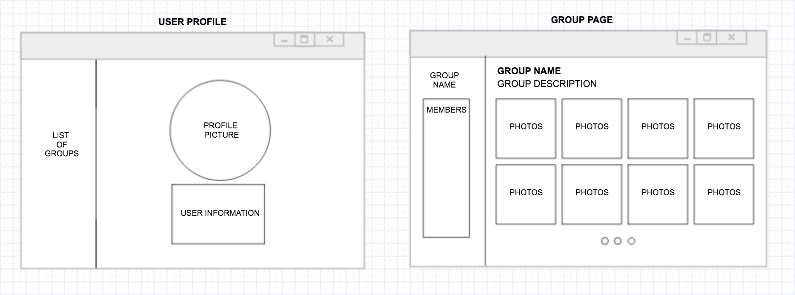

# Project 2: Until We Part
---
*Dedicated to my family.*

## Origin
My commute from home to school was pretty bad since I was 16 years old. Just around 7,000 miles? Having to live away from home, away from family, not only was I very homesick, but I always run low in phone storage: my mother sends a lot of videos and photos, and asks for a lot too. 

Therefore, I created a web application dedicating to my family, my mom in particular. This application is a private-group application for photos and diaries. Simply put, an old-fashioned family album brought back. This application is designed for families or any group, therefore, I ultimately want this application to be easily usable by elderly as well.

## Development & Technologies
This application is built using Ruby on Rails, Bootstrap, CSS, and HTML.

## MVP
- An user should be able to create an account, log in to the account, and create a post to a specific group.
- Be able to perform a CRUD (create, read, update, destroy) on the account itself, and the posts.

## Project Organization
**Wireframe**

**ERD Model**

[User stories List](https://1drv.ms/x/s!Atf2EKHjvdCefr2WRWuA0Uk9n9g)

[Trello Board](https://trello.com/b/qfFxrfLE/project-02-until-we-part)
## Dream Features
- Send an invitation email to a member to invite to a specific group.
- Run a countdown to show how much time is left for the user to spend with that group. 
- If the user checks in a box for an easier UI, the interface changes. (Feature for the elderly to use this app with their children or grandchildren.)
- Movie "Inside Out" Theme: collect each post as a "memory pearl" for the group by color coding, etc.

